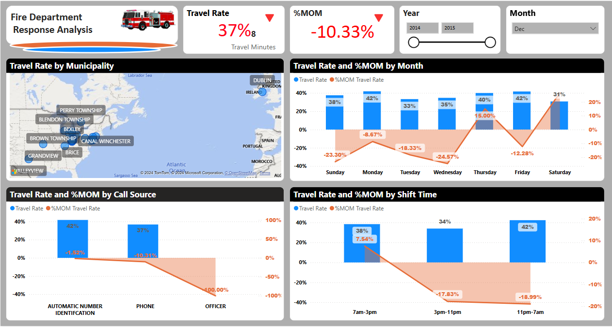
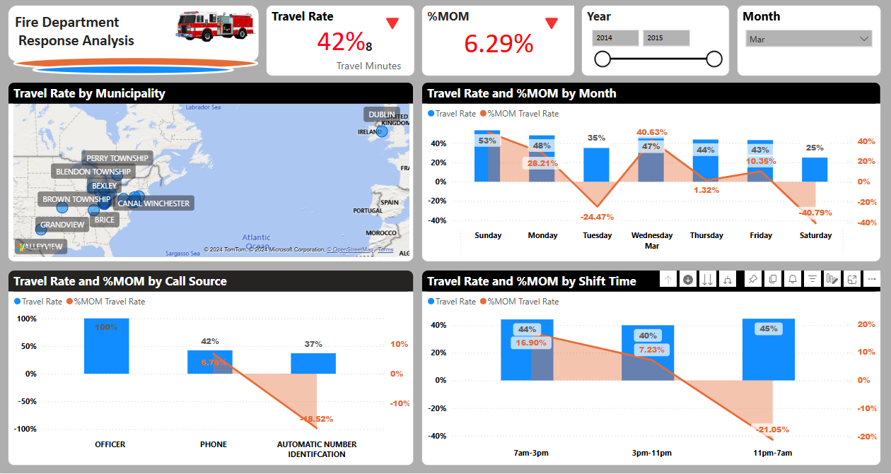

 
# Fire Department Response Analysis
## Problem
Use SQL to process and analyze **Fire Department** Call Data and extract KPI (Alarm time, Turnout time, Travel time and Response time) by Shift times.

## Solution
- Queried large datasets using complex joins and subqueries.
- Used `CASE` statements to generate KPI's, and Work shifts.
- Created summary reports using SQL `GROUP BY` and aggregation functions.

## Key Components of pre-aggregated data
- Month and Day Information using Date Functions
  DATENAME(MONTH, Create_Date) as Month_: This gives you the name of the month.
  DATENAME(WEEKDAY, Create_Date) as DayWeek_: Extracts the name of the weekday.
  MTD_Incidents: Counts the incidents month-to-date using a WINDOW function (PARTITION BY YEAR, MONTH).
  YTD_Incidents: Counts the incidents year-to-date.
  
- CASE statement
  Assign the appropriate shift (7am-3pm, 3pm-11pm, or 11pm-7am) based on the hour of the Create_Date.
  Generate KPI
  AlarmTime_1Min: Whether the unit was dispatched within 1 minute.
  TurnOutTime_1Min: Whether the unit responded within 1 minute.
  TravelTime_8Mins: Whether transport took less than 8 minutes.
  ResponseTime_11Mins: Whether the overall response time was under 11 minutes.
- Grouping:
  The query groups by multiple fields such as Call_Type, Create_Date, EventFirstDispatched, etc., which ensures that you can apply aggregate functions like COUNT.
  
## Problem Statement
The goal of this dashboard is to  analyze fire department response metrics, specifically focusing on Travel Rate and its Month-over-Month (MOM) Percentage Change. 
The problem centers on identifying trends and potential inefficiencies in response times across:
- Municipalities
- Days of the Week
- Shift Times
- Call Sources

## Observations and Insights
 ### Overall Travel Rate and MOM Change:
- Travel Rate is 42%, with a 6.29% MOM decrease. This suggests that travel times have decreased slightly compared to the previous month.
  
### Travel Rate and %MOM by Days of the Week:
- Travel Rate is highest on **Sunday (53%)**, gradually decreasing throughout the week, with the lowest rate on Saturday (25%).
- Monday (-28.21%)  : Major improvement in travel rate compared to the prior period.
- Saturday (-40.79%): A sharp decline, possibly indicating operational challenges on weekends.
  
### Travel Rate by Call Source:
- Calls from Officers result in the highest travel rates (100%).
- **Phone calls and Automatic Number Identification** have lower rates and negative MOM changes, particularly Automatic Number Identification (-18.52%).
  
### Travel Rate by Shift Times:
- **Highest travel rate** is during the **11 PM – 7 AM shift**  (45%), while 7 AM – 3 PM (44%) and 3 PM – 11 PM (40%) follow closely.
- 7 AM – 3 PM (+16.90%) indicates improved response efficiency.
- 11 PM – 7 AM (-21.05%) shows a decline in performance.

### **Conclusions**

- Performance Issues on Weekends:
  Travel rates drop sharply on Saturdays, possibly due to reduced staffing or increased demand.
  Geographic Disparities:
- Travel rates vary significantly between municipalities, suggesting potential challenges like road conditions, traffic, or resource allocation.
  Shift Efficiency:
- The nighttime shift _(11 PM – 7 AM)_ shows a decline in MOM performance, possibly due to staffing or visibility challenges.
- Officer-initiated responses are the most efficient, whereas Automatic Number Identification may require process improvements.
  
### **Recommendations**

- Investigate the causes of reduced efficiency on Saturdays and in specific municipalities.
- Analyze operational processes during the **11 PM – 7 AM** shift to improve nighttime response times.
- Review the effectiveness of **Automatic Number Identification** and explore enhancements to improve travel rates.

## **SQL Techniques Used**
  - CASE statemens
  - Date functions
  - Aggregation
  - Window function (partition)
  - Sample SQL code:
    
CREATE VIEW vwFD_Data

		AS

		SELECT *,
	
		DATENAME(MONTH,Create_date) as Month_,
		count(Call_Type) OVER (PARTITION BY YEAR  (Create_Date),MONTH (Create_Date) ORDER BY Create_date) AS  MTD_Incidents,
		count(Call_Type) OVER (PARTITION BY YEAR  (Create_Date) ORDER BY Create_date)  AS YTD_Incidents,
	
		DATENAME(WEEKDAY,Create_date) as DayWeek_,
		DATEPART(WEEKDAY,Create_date) as WeekDay_,
		RIGHT(CONVERT(VARCHAR(19),EventFirstDispatched,0), 7) as Time_,
		/* Code for adding Shift to the table */

		 CASE
			WHEN DATEPART(HOUR,Create_Date) >= 7  AND DATEPART(HOUR,Create_Date) <  15 THEN    '7am-3pm'
			WHEN DATEPART(HOUR,Create_Date) >= 15 AND DATEPART(HOUR,Create_Date) <  23	THEN '3pm-11pm' 
			ELSE '11pm-7am'END ShiftName,
		Count(Call_Type) as CallTypeCount,
		/* code for creating time differences, setting up the KPI */	
		CASE WHEN DATEDIFF(MINUTE,EventFirstDispatched,EventFirstEnroute) <= 1 THEN 1 ELSE 0 END AlarmTime_1Min,
		CASE WHEN DATEDIFF(MINUTE,Create_Date,EventFirstDispatched) <=1 THEN 1 ELSE 0 END TurnOutTime_1Min,
		CASE WHEN DATEDIFF(MINUTE,StartTransport,TransportArrive) <= 8 THEN 1 ELSE 0 END TravelTime_8Mins,
		CASE WHEN DATEDIFF(MINUTE,EventFirstDispatched,EventFirstArrive) <= 11 THEN 1 ELSE 0 END ResponseTime_11Mins

		FROM		dbo.FD_Table
		GROUP BY	 Call_Source,Call_Type,Create_Date,Create_Year,Create_Month,EventFirstDispatched,
					EventFirstArrive,EventFirstEnroute,LastKnownLatitude,LastKnownLongitude,FirstArriveEngine,
					StartTransport,TransportArrive,Close_Date,Municipality,Beat
    
### Interact with the report

### _https://app.powerbi.com/reportEmbed?reportId=ec68accf-cd17-4e10-863b-dbed736eda64&autoAuth=true&ctid=78d1fb89-a6cc-4862-a67c-a7287504e26f_
